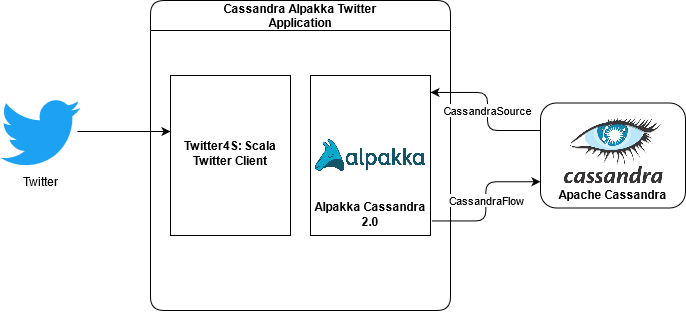

# Alpakka Cassandra and Twitter

## About this Project

This project is a Scala application which uses [Alpakka Cassandra 2.0](https://doc.akka.io/docs/alpakka/current/cassandra.html), [Akka Streams](https://doc.akka.io/docs/akka/current/stream/index.html) and [Twitter4S](https://github.com/DanielaSfregola/twitter4s) (Scala Twitter Client) to pull new Tweets from Twitter for a given hashtag (or set of hashtags) using Twitter API v1.1 and write them into a local Cassandra database. 

**NOTE:** The project will only save tweets which are not a retweet of another tweet and currently only saves the truncated version of tweets (<=140 chars). 

  

- - - 

## Requirements

- Scala 2.12+
- JDK 8
- sbt (this project uses 1.4.9)
- Docker (and required RAM for running a Cassandra container)

- - -

## Table of Contents
1. [Setup and run local Cassandra using Docker](#1-cassandra-setup)
2. [Configure Twitter API keys](#2-twitter-setup)
3. [Setup hashtags and run the project using SBT](#3-running-the-project)
4. [Observe results in Cassandra using cqlsh](#4-observe-tables)

- - - 
## 1. Cassandra Setup
### 1.1 - Make sure you have docker installed on your machine. Run the following docker command to pull up a local Cassandra container with port 9042 exposed: 
```bash
docker run -p 9042:9042 --rm --name my-cassandra -d cassandra
```

### 1.2 - Make sure your container is running (may need to give the container a few minutes to boot up): 
```bash
docker ps -a
```

  
The above output shows that the container has been running for 3 minutes, and also shows that port 9042 locally is bound to port 9042 in the container. (default port for Cassandra)  

### 1.3 - Afterwards, run CQLSH on the container in interactive terminal mode to setup keyspace and tables: 
```bash
docker exec -it my-cassandra cqlsh
```

### 1.4 - Once CQLSH comes up, create the necessary keyspace and table for this demo.

```bash
CREATE KEYSPACE testkeyspace WITH replication = {'class': 'SimpleStrategy', 'replication_factor': '1'}  AND durable_writes = true;

CREATE table testkeyspace.testtable(id bigint PRIMARY KEY, excerpt text);  

INSERT INTO testkeyspace.testtable(id, excerpt)
VALUES (37, 'appletest');

exit
```

## 2. Twitter Setup

### 2.1 - From the root folder of this repository, browse to the `application.conf.example` file found in `/src/main/resources/application.conf.example`. Copy this file into this same directory and rename it `application.conf`

```bash
mv /src/main/resources/application.conf.example /src/main/resources/application.conf
```

### 2.2 - Go to the [twitter developer dashboard](https://developer.twitter.com/en/portal/dashboard) website, register an application and insert these four twitter api keys into this portion of `application.conf`: 
```
twitter {
  consumer {
    key = "consumer-key-here"
    secret = "consumer-secret-here"
  }
  access {
    key = "access-key-here"
    secret = "access-token-here"
  }
}
```
- - -

## 3. Running The Project

### 3.1 - Navigate to `/src/main/scala/com/alptwitter/AlpakkaTwitter.scala` and change the following line to indicate what hashtags you wish to look at new tweets for `val trackedWords = Seq("#myHashtag")`:

```bash
vim /workspace/example-cassandra-alpakka-twitter/src/main/scala/com/alptwitter/AlpakkaTwitter.scala
```

If you want to track more than one hashtag, add more by adding more strings and separating with commas. 

### 3.2 - The project can then be run by navigating to the root folder of the project and running: 
```bash
sbt run
```
As new tweets are posted which contain any of the hashtags listed in the trackedWords variable, a message will print in the console which says whether the tweet was a retweet or a unique tweet.
- - -

## 4. Observe Tables
### 4.1 - As new tweets (not retweets of tweets) with your entered hashtags are posted and found, they will be saved to Cassandra as a (tweet id, text of tweet) entry in testkeyspace.testtable. To check that the tweets are being saved to Cassandra, run CQLSH on the cassandra container and observe the table: 

```bash
docker exec -it my-cassandra cqlsh
SELECT * FROM testkeyspace.testtable; 
```

- - -
## References / Useful Links: 
### [Twitter4S (Twitter for Scala) Github Repository](https://github.com/DanielaSfregola/twitter4s)
### [Twitter4S definition of Tweet object](https://github.com/DanielaSfregola/twitter4s/blob/master/src/main/scala/com/danielasfregola/twitter4s/entities/Tweet.scala)
### [Alpakka Cassandra Documentation](https://doc.akka.io/docs/alpakka/2.0.2/cassandra.html)
